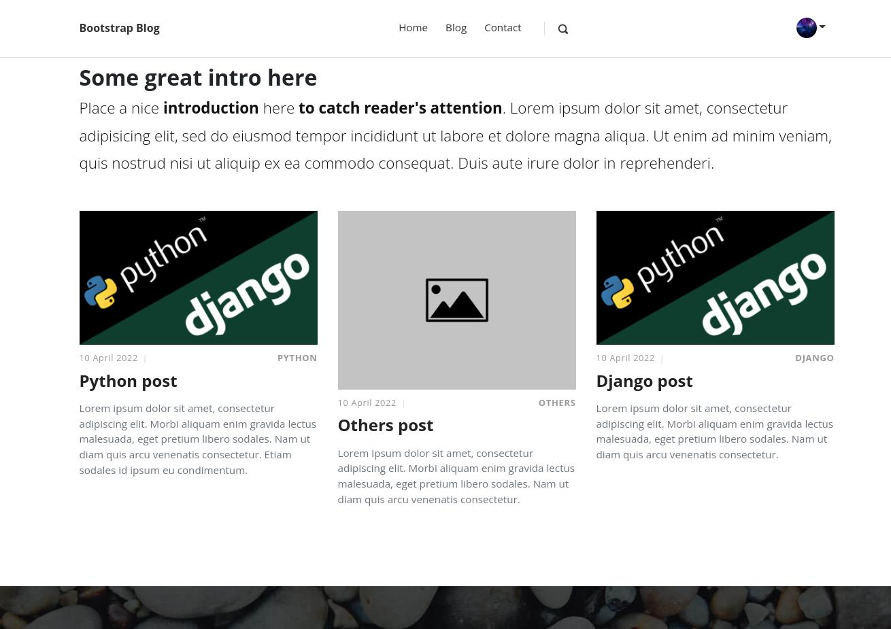
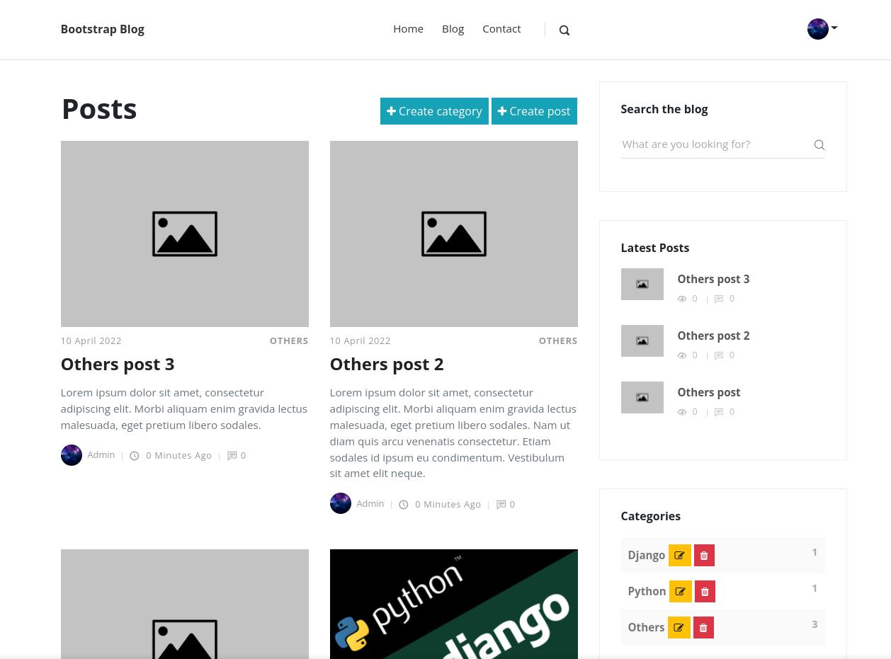
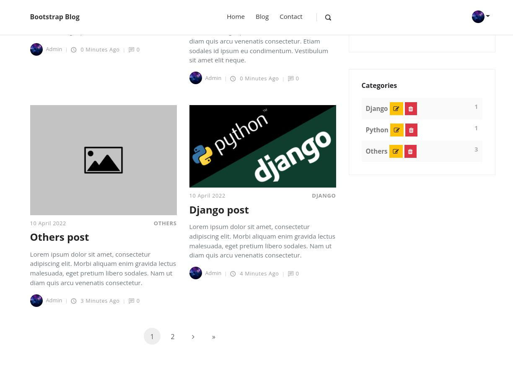
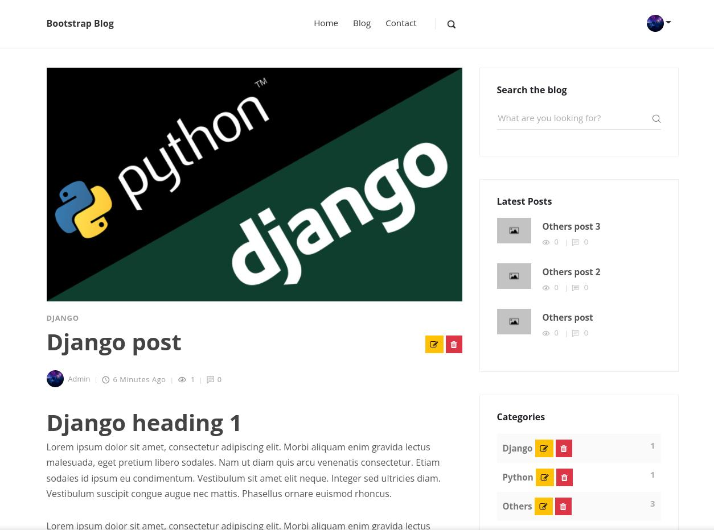
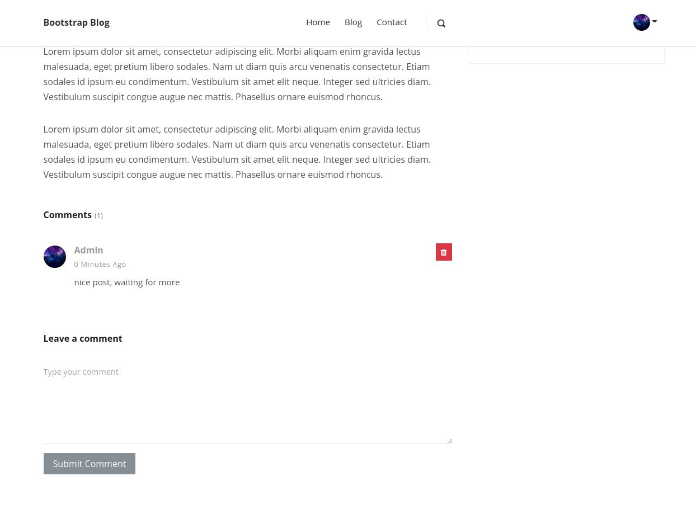
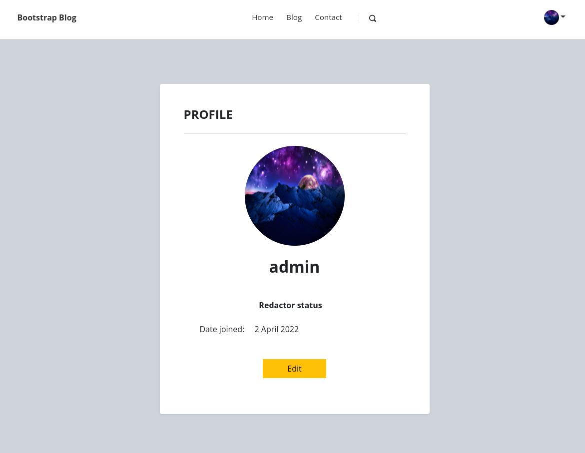

# Preview
  django-blog is a simple blog built with Django.

## Features
* posts and categories CRUD functionality
* user authentication system
* posts commenting system
* user profiles
* template-based interface styled with bootstrap
* search system
* category filtering
* email notification and feedback system
* redactor status allowing user to CRUD posts and comments
  
  
  
  
  
  
  
  
## Setup
To get this repository, run the following command inside your terminal:
```
git clone https://github.com/pietrykovsky/django-blog.git
```

Create and start a a virtual environment:
```
python -m venv env
```
```
source env/bin/activate      # On Windows use `env\Scripts\activate`
```
Install the project dependencies:
```
pip install -r requirements.txt
```
This will create all the migrations file (database migrations) required to run this project:
```
python manage.py makemigrations
```
Now, to apply this migrations run the following command:
```
python manage.py migrate
```
Now we need to create admin user:
```
python manage.py createsuperuser
```
And finnaly we can run our local server:
```
python manage.py runserver
```
Setup mail backend in settings.py
```
EMAIL_HOST_USER = 'your_email@gmail.com'
EMAIL_HOST_PASSWORD = 'your_password'
DEFAULT_FROM_EMAIL = 'default@gmail.com'
```
Once the server is hosted, head over to http://127.0.0.1:8000/

